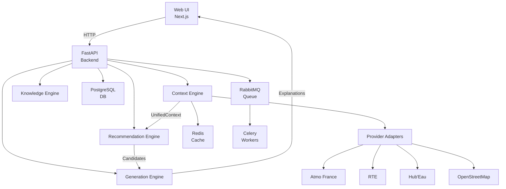
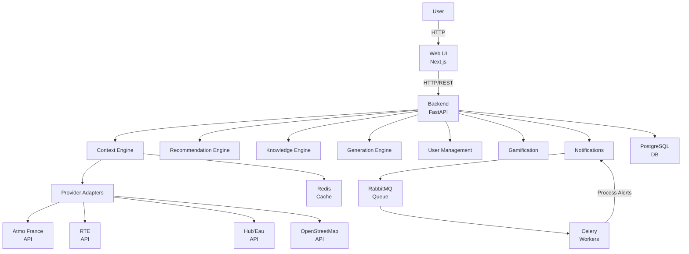
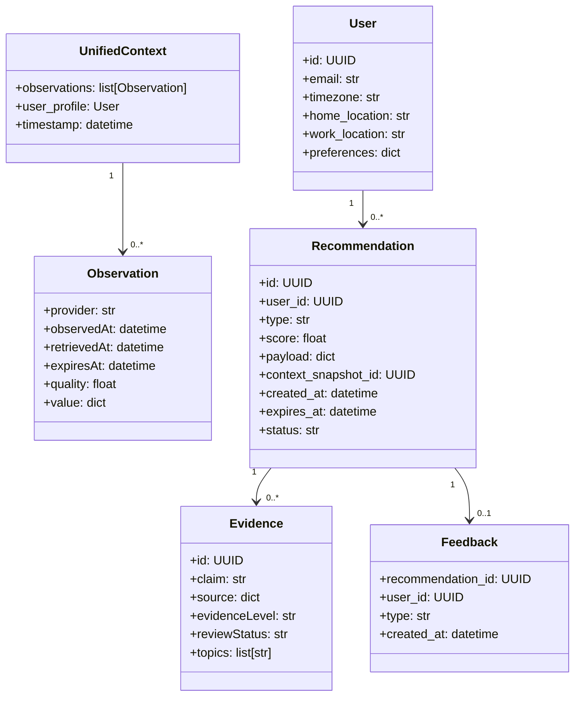
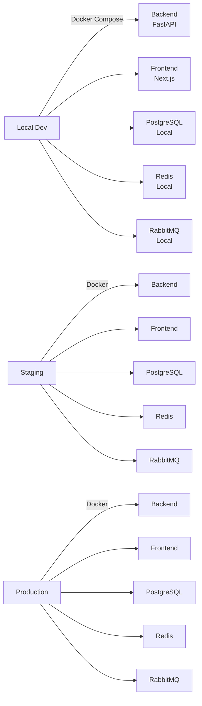

# Architecture Spine — Almanéa

## Design Paradigm
**Modular Monolith** : All engines are modules within a single deployable unit (backend: FastAPI + Python).
- **Layers** :
  - **Presentation** : Next.js (Web UI)
  - **Application** : FastAPI (REST/HTTP endpoints)
  - **Domain** : Engines (Context, Recommendation, Knowledge, Generation)
  - **Infrastructure** : Providers, Adapters, Database, Cache, Message Queue



## Inherited Invariants
*None (this is the root spine for the feature).*

## Invariants & Rules

### AD-1 — Modular Monolith Paradigm
- **Binds**: all
- **Prevents**: Divergence in deployment units or inter-module communication protocols.
- **Rule**: All modules must expose clear interfaces (Python ABCs/protocols) and communicate via well-defined contracts (e.g., `UnifiedContext`).

### AD-2 — Provider-Agnostic Adapters
- **Binds**: Context Engine, FR-1, FR-2, FR-3, FR-5
- **Prevents**: Vendor lock-in and inconsistent data fetching/normalization across providers.
- **Rule**: Each provider (Atmo France, RTE, Hub'Eau, OSM) has a dedicated adapter implementing `ProviderAdapter` with `fetch()`, `normalize()`, `validate()`.

### AD-3 — LLM-Agnostic Generation
- **Binds**: Generation Engine, FR-14, FR-15, FR-16
- **Prevents**: Dependency on a specific LLM vendor.
- **Rule**: `LLMProvider` interface exposes `generate(prompt: str, context: dict) -> str`. Fallback to deterministic explanations if LLM is unavailable.

### AD-4 — Unified Context Contract
- **Binds**: Context Engine, Recommendation Engine, FR-4
- **Prevents**: Inconsistent data formats between engines.
- **Rule**: `UnifiedContext` includes `observations` (list of `Observation`), `user_profile` (optional), `timestamp`. Each `Observation` contains `provider`, `observedAt`, `retrievedAt`, `expiresAt`, `quality`, `value`.

### AD-5 — Deterministic Recommendations
- **Binds**: Recommendation Engine, FR-6, FR-7, FR-8, FR-10
- **Prevents**: Non-reproducible recommendation generation.
- **Rule**: Scoring formula: `Score = 25% ContextFit + 20% TimeFit + 15% UserPreference + 15% Accessibility + 10% EnvironmentalOpportunity + 10% WellbeingOpportunity + 5% Novelty`. All inputs must be deterministic.

### AD-6 — Rule Engine Priority
- **Binds**: Recommendation Engine, FR-9
- **Prevents**: Conflicting recommendations (e.g., outdoor activity during poor air quality).
- **Rule**: Priority order: 1) Safety (e.g., air quality), 2) Legal restrictions (e.g., water bans), 3) Technical constraints (e.g., missing data), 4) User preferences.

### AD-7 — Caching Strategy
- **Binds**: Context Engine, FR-3
- **Prevents**: Rate limit issues and unnecessary external API calls.
- **Rule**: Cache TTL: 5 minutes for real-time data (e.g., air quality), 1 hour for static data (e.g., lunar phases). Fallback to last valid cached value if provider fails.

### AD-8 — Alert Delivery SLA
- **Binds**: Notifications, FR-32
- **Prevents**: Late delivery of time-sensitive alerts.
- **Rule**: Use async message queue (RabbitMQ) + dedicated workers (Celery) for alert processing. Cache alerts in Redis to avoid duplicates. Prioritize critical alerts over non-critical ones.

### AD-9 — Gamification Determinism
- **Binds**: Gamification, FR-21, FR-22, FR-23, FR-24, FR-25, FR-26, FR-27, FR-28, FR-29, FR-30
- **Prevents**: Inconsistent or unfair point/badge allocation.
- **Rule**: Points are calculated server-side using fixed rules (e.g., +120 points for bike ride). Badges are awarded based on predefined thresholds (e.g., 5 repairs = "Réparateur" badge).

### AD-10 — Web UI Mobile-First
- **Binds**: Web UI, FR-34, FR-35, FR-36
- **Prevents**: Poor user experience on mobile devices.
- **Rule**: Use TailwindCSS for styling. Navigation: 5 bottom tabs + floating central button for actions. Prioritize touch-friendly interactions.

## Consistency Conventions

| Concern | Convention |
| --- | --- |
| **Naming** | Snake_case for Python (modules, functions), PascalCase for TypeScript (components, types). Prefix interfaces with `I` (e.g., `IProviderAdapter`). |
| **Data & Formats** | ISO 8601 for timestamps. JSON for API responses. `Observation` and `UnifiedContext` use Pydantic models for validation. |
| **State & Cross-Cutting** | Immutable data where possible. Structured logging (JSON). Centralized error handling (custom exceptions). Config via environment variables. |
| **Dependencies** | Pin all dependencies (e.g., `fastapi==0.109.0`). Use `pyproject.toml` for Python, `package.json` for Node.js. |

## Stack

| Name | Version | Purpose |
| --- | --- | --- |
| Python | 3.11.8 | Backend language |
| FastAPI | 0.109.0 | Backend framework |
| Next.js | 14.1.0 | Frontend framework |
| PostgreSQL | 15.7 | Primary database |
| Redis | 7.2.4 | Cache and session store |
| RabbitMQ | 3.12.0 | Message queue for alerts |
| Celery | 5.3.4 | Background task workers |
| TailwindCSS | 3.4.0 | Frontend styling |
| Pydantic | 2.5.3 | Data validation |
| SQLAlchemy | 2.0.23 | ORM |
| Alembic | 1.13.1 | Database migrations |

## Structural Seed

### System Context Diagram


### Core Entity Relationships


### Source Tree
```text
almanea/
  backend/
    core/
      __init__.py
      config.py          # Centralized config (pydantic-settings)
      exceptions.py      # Custom exceptions
      logging.py         # Structured logging setup
    engines/
      __init__.py
      context_engine/
        __init__.py
        models.py        # UnifiedContext, Observation (Pydantic)
        adapter.py       # ProviderAdapter (ABC)
        providers/
          __init__.py
          atmo.py         # Atmo France adapter
          rte.py          # RTE adapter
          hubeau.py       # Hub'Eau adapter
          osm.py          # OpenStreetMap adapter
        context_builder.py # Builds UnifiedContext from adapters
      recommendation_engine/
        __init__.py
        models.py        # Recommendation, Candidate
        rule_engine.py   # Rule Engine (deterministic)
        scoring.py       # Scoring formula (AD-5)
      knowledge_engine/
        __init__.py
        models.py        # Evidence
        repository.py    # Evidence storage/retrieval
      generation_engine/
        __init__.py
        llm_provider.py   # LLMProvider (ABC)
        fallback.py       # Deterministic fallbacks (FR-16)
    user_management/
      __init__.py
      models.py        # User, UserProfile
      repository.py    # User CRUD
    gamification/
      __init__.py
      models.py        # Points, Badges, Challenges
      rules.py         # Point calculation rules
    notifications/
      __init__.py
      models.py        # Alert, Notification
      queue.py         # RabbitMQ + Celery integration
    api/
      __init__.py
      endpoints/
        context.py      # Context Engine endpoints
        recommendations.py # Recommendation endpoints
        users.py         # User endpoints
        gamification.py  # Gamification endpoints
        notifications.py # Notification endpoints
      schemas.py        # API schemas (Pydantic)
    db/
      __init__.py
      models.py        # SQLAlchemy models
      session.py       # DB session management
    main.py            # FastAPI app entrypoint
    
  frontend/
    app/
      layout.tsx       # Root layout
      page.tsx         # Home page
      (today)/          # Today's recommendations
      (explore)/        # Explore activities
      (actions)/        # Declare actions
      (impact)/         # Points, badges, history
      (profile)/        # User profile
      components/
        ui/             # Reusable UI components (shadcn/ui)
        recommendations/ # Recommendation cards
        context/        # Context display (weather, air quality)
    lib/
      api.ts           # API client
      types.ts         # TypeScript types
    
  docker/
    Dockerfile.backend
    Dockerfile.frontend
    docker-compose.yml
    
  tests/
    unit/
      test_context_engine.py
      test_recommendation_engine.py
      test_scoring.py
    integration/
      test_api.py
    
  .env.example
  pyproject.toml
  package.json
  README.md
```

### Deployment & Environments


## Capability → Architecture Map

| Capability / Area | Lives in | Governed by |
| --- | --- | --- |
| Collecte des données externes (FR-1) | `backend/engines/context_engine/providers/` | AD-2, AD-4 |
| Normalisation des données (FR-2) | `backend/engines/context_engine/adapter.py` | AD-2, AD-4 |
| Mise en cache (FR-3) | `backend/engines/context_engine/context_builder.py` + Redis | AD-7 |
| Enrichissement du contexte (FR-4) | `backend/engines/context_engine/context_builder.py` | AD-4 |
| Génération de candidats (FR-6) | `backend/engines/recommendation_engine/rule_engine.py` | AD-5, AD-6 |
| Calcul du score (FR-7) | `backend/engines/recommendation_engine/scoring.py` | AD-5 |
| Classement des recommandations (FR-8) | `backend/engines/recommendation_engine/` | AD-5 |
| Filtrage des recommandations (FR-9) | `backend/engines/recommendation_engine/rule_engine.py` | AD-6 |
| Génération d'explications (FR-14) | `backend/engines/generation_engine/` | AD-3 |
| Abstraction LLM (FR-15) | `backend/engines/generation_engine/llm_provider.py` | AD-3 |
| Fallback déterministe (FR-16) | `backend/engines/generation_engine/fallback.py` | AD-3 |
| Gestion des utilisateurs (FR-17, FR-18) | `backend/user_management/` | AD-10 |
| Gamification (FR-21 à FR-30) | `backend/gamification/` | AD-9 |
| Notifications (FR-31, FR-32) | `backend/notifications/` | AD-8 |
| Web UI (FR-34 à FR-36) | `frontend/` | AD-10 |

## Deferred

| Decision | Reason | Revisit Condition |
| --- | --- | --- |
| Horizontal scaling | PoC phase targets single-server deployment. | Traffic > 10K daily active users. |
| Sharding for PostgreSQL/Redis | Expected data volume (<100K observations/day) is manageable without sharding. | Volume > 1M observations/day. |
| Multi-region deployment | Initial focus on France (local providers). | Expansion to other countries. |
| Advanced monitoring (Prometheus + Grafana) | Basic logging and SLA tracking suffice for PoC. | Need for real-time SLA monitoring in production. |
| Native mobile apps | PoC focuses on Web UI (Next.js). | Early Access phase (EA). |
| MCP (Model Context Protocol) integration | Deferred to GA phase. | Interoperability requirements with external agents. |
